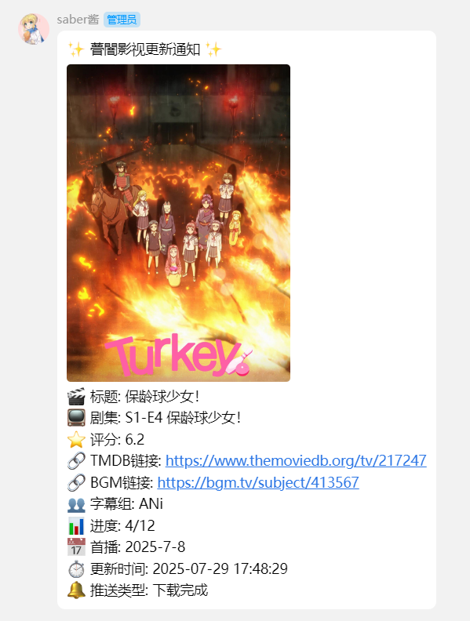
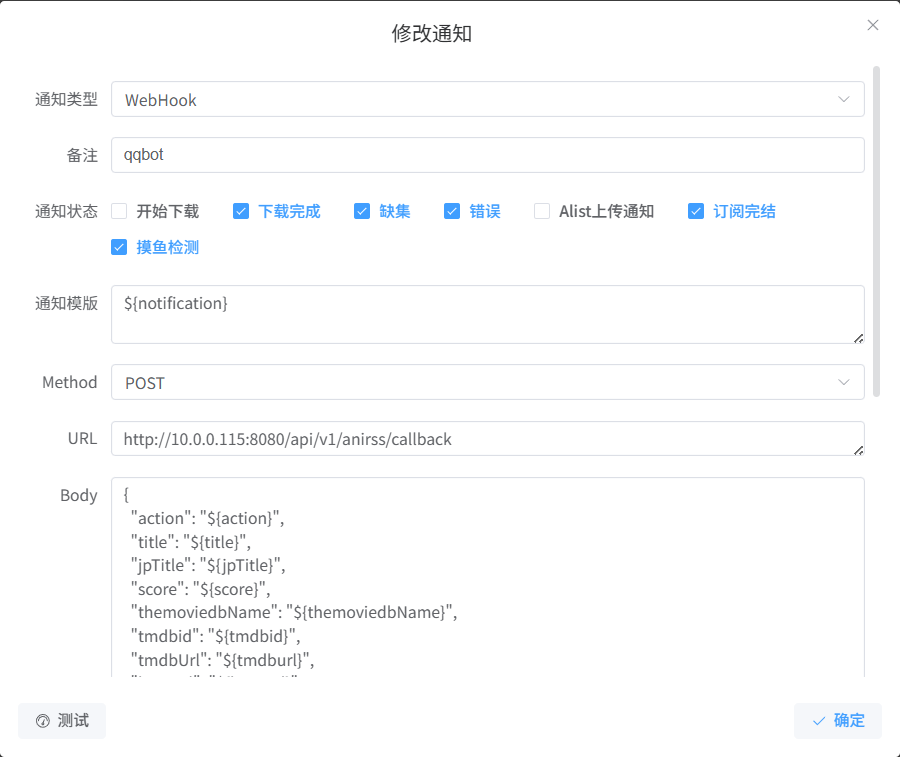

# anirsspusher

**anirsspusher** 是一个用于接收 ani-rss webhook消息并通过 QQ 推送通知的机器人。
## 功能

- 接收 ani-rss webhook消息源。
- 自动解析更新的影视信息。
- 支持通过 QQ 群组和私聊发送通知。
- 消息内容包括标题、剧集信息、评分、链接等详细信息。



## 配置
### anirsspusher 配置

1.修改配置文件

配置文件位于 `conf/config.toml`，示例如下：

```toml
host = "192.168.1.1"        # QQ 机器人服务地址
port = 3000                 # QQ 机器人服务端口
token = "abcd12234"         # QQ 机器人认证 Token
level = 0                   # 日志级别
group_ids = [123456,123345] # 推送的 QQ 群组 ID 列表
user_ids = [1234567]        # 推送的 QQ 用户 ID 列表
```

2.构建docker镜像

```bash
docker build --force-rm --no-cache -t local/anipublish:v1 .
```

3.使用docker-compose部署
```
version: "3"
services:
    anirsspusher:
        environment:
            - TZ=Asia/Shanghai # 设置时区
        volumes:
            - ./conf:/conf # 挂载配置
        ports:
            - 8080:8080 # webhook HTTP 端口
        container_name: anirsspusher
        network_mode: bridge
        restart: always
        image: local/anipublish:v1
```

###  llonebot 配置
使用docker-compose部署
```
version: "3"
services:
    llonebot:
        environment:
            - VNC_PASSWD=${VNC_PASSWD} # 设置 VNC 密码（通过环境变量传递）
        volumes:
            - ./QQ:/root/.config/QQ # 挂载 QQ 配置目录
            - ./llonebot:/root/llonebot # 挂载 llonebot 数据目录
        ports:
            - 3000:3000 # OneBot HTTP 端口
            - 3001:3001 # OneBot WebSocket 端口
            - 5600:5600 # Satori 端口
            - 5900:5900 # novnc
            - 7081:7081 # vnc
            - 13000:13000 # pmhq
        container_name: llonebot
        network_mode: bridge
        restart: always
        image: initialencounter/llonebot:latest
```
## 使用方法
1. 将配置文件 config.toml 修改为你的实际配置, 放于挂载目录下。
2. 启动 llonebot 和 anirsspusher docker。
3. 登录ani-rss服务后台，配置webhook
   - URL地址填写为 `http://<your-server-ip>:8080/api/v1/anirss/callback`
   - boyd填写
      ```json
      {
          "action": "${action}",
          "title": "${title}",
          "jpTitle": "${jpTitle}",
          "score": "${score}",
          "themoviedbName": "${themoviedbName}",
          "tmdbid": "${tmdbid}",
          "tmdbUrl": "${tmdburl}",
          "bgmUrl": "${bgmUrl}",
          "season": "${season}",
          "episode": "${episode}",
          "subgroup": "${subgroup}",
          "progress": "${currentEpisodeNumber}/${totalEpisodeNumber}",
          "premiere": "${year}-${month}-${date}",
          "text": "${text}",
          "downloadPath": "${downloadPath}",
          "episodeTitle": "${episodeTitle}",
          "bgmEpisodeTitle": "${bgmEpisodeTitle}",
          "bgmJpEpisodeTitle": "${bgmJpEpisodeTitle}",
          "image": "${image}"
      }
      ```

## 项目参考
[nonebot-plugin-AniPusher](https://github.com/AriadusTT/nonebot-plugin-AniPusher)

